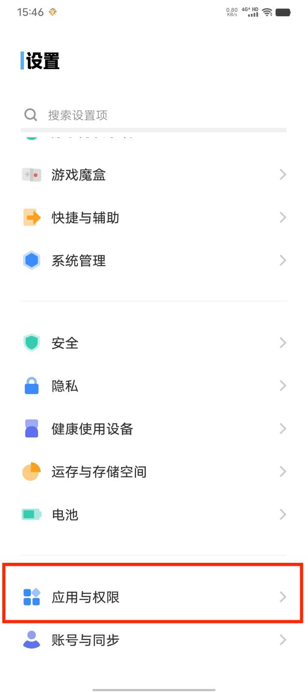

# 应用角标常见问题解答

在使用小习惯App的过程中，您可能会遇到关于应用角标显示的一些疑问。以下是一些常见问题及其说明：

## 1. 应用角标更新不及时？

**原因：**

小习惯App的角标信息依赖于手机系统从App读取数据来更新。由于系统更新机制的限制，角标的刷新可能存在一定的延迟，并非实时同步。您可以尝试打开App，这通常会触发一次角标更新。

## 2. VIVO手机无法显示应用角标？

**原因：**

根据Vivo手机系统的要求，应用需要获得“通知”权限才能在桌面图标上显示角标。

**解决方法：**

请确保您已为小习惯App开启了通知权限。您可以按照以下路径进行设置：

`手机设置` -> `应用与权限` -> `应用管理` -> `小习惯` -> `通知` -> `允许通知打开，桌面角标勾选上`

<figure style="display: inline-block; margin: 15px; text-align: center;">
  
  <figcaption>步骤1：进入应用管理</figcaption>
</figure>
<figure style="display: inline-block; margin: 15px; text-align: center;">
  
  <figcaption>步骤2：找到小习惯App</figcaption>
</figure>
<figure style="display: inline-block; margin: 15px; text-align: center;">
  
  <figcaption>步骤3：进入通知设置</figcaption>
</figure>
<figure style="display: inline-block; margin: 15px; text-align: center;">
  
  <figcaption>步骤4：允许通知</figcaption>
</figure>
<figure style="display: inline-block; margin: 15px; text-align: center;">
  
  <figcaption>步骤5：开启桌面角标</figcaption>
</figure>

开启通知权限后，应用角标即可正常显示。

---

如果您遇到其他关于应用角标的问题，欢迎通过App内的“帮助与反馈”联系我们。